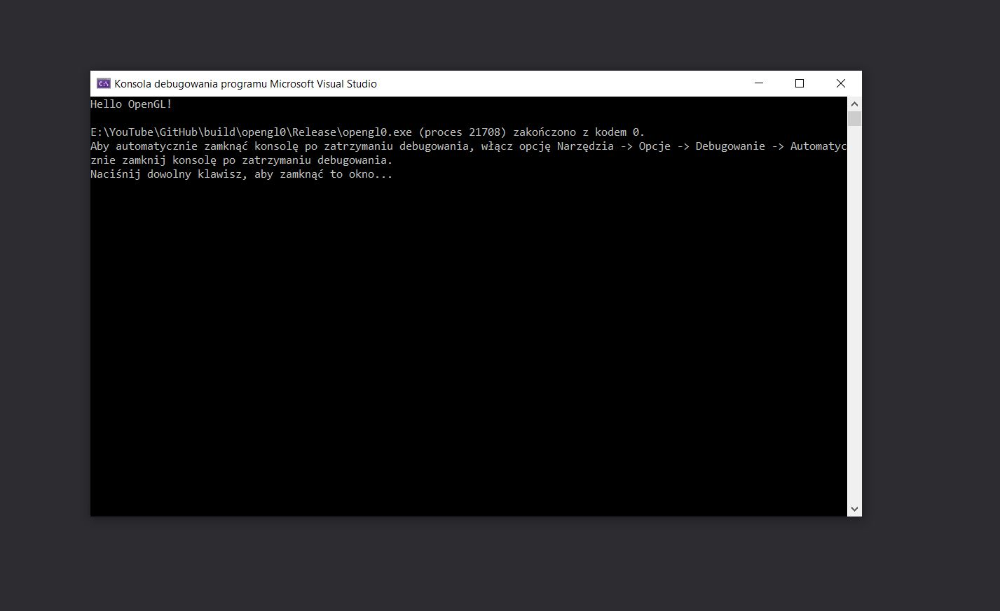

# 000 - Hello OpenGL, czyli wprowadzenie i konfiguracja
W tej części naszej serii zajmujemy się konfiguracją naszego środowiska przy użyciu **Visual Studio** oraz **CMake**.
Opowiadam trochę o historii tej biblioteki oraz o tym jakich konwencji będziemy się trzymać

# Wynik

